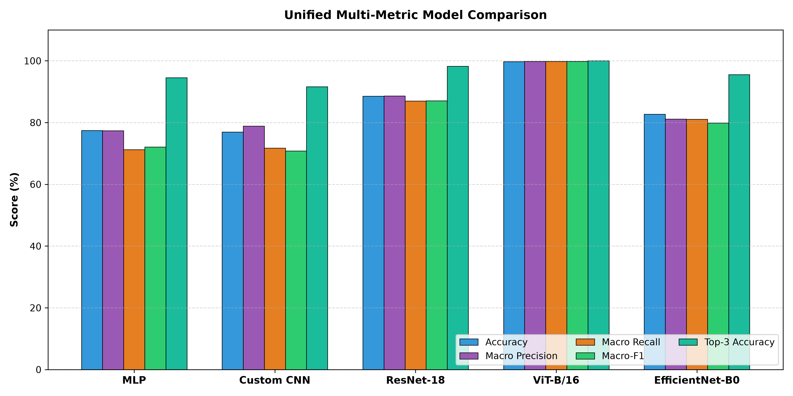
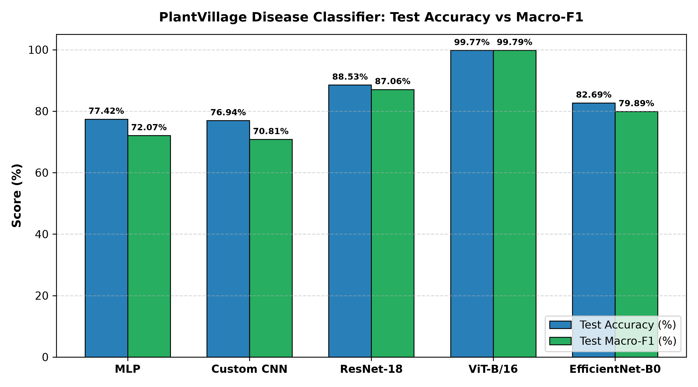
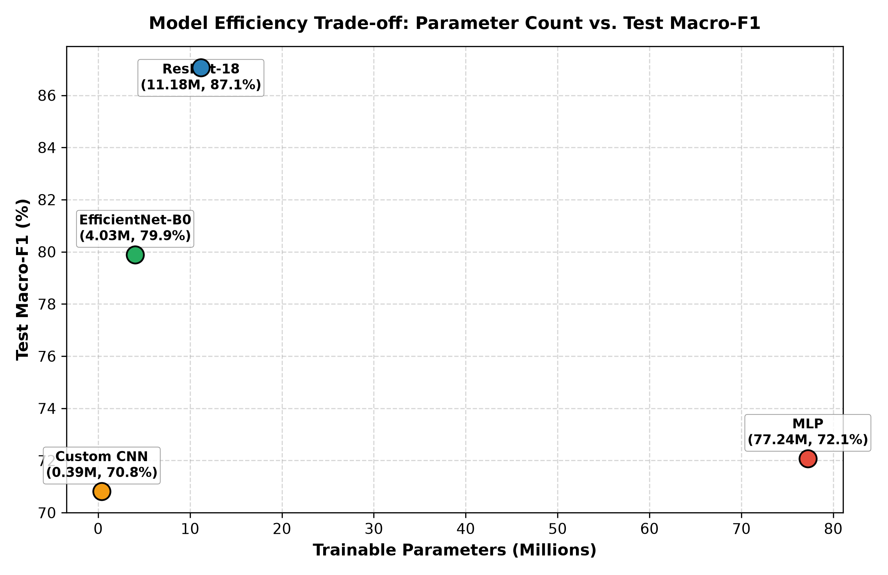
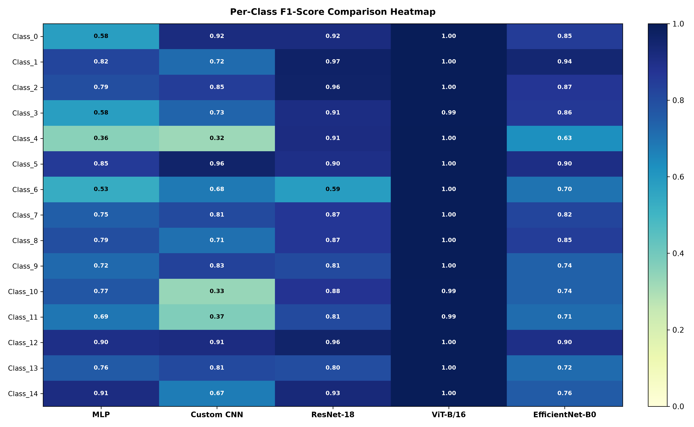
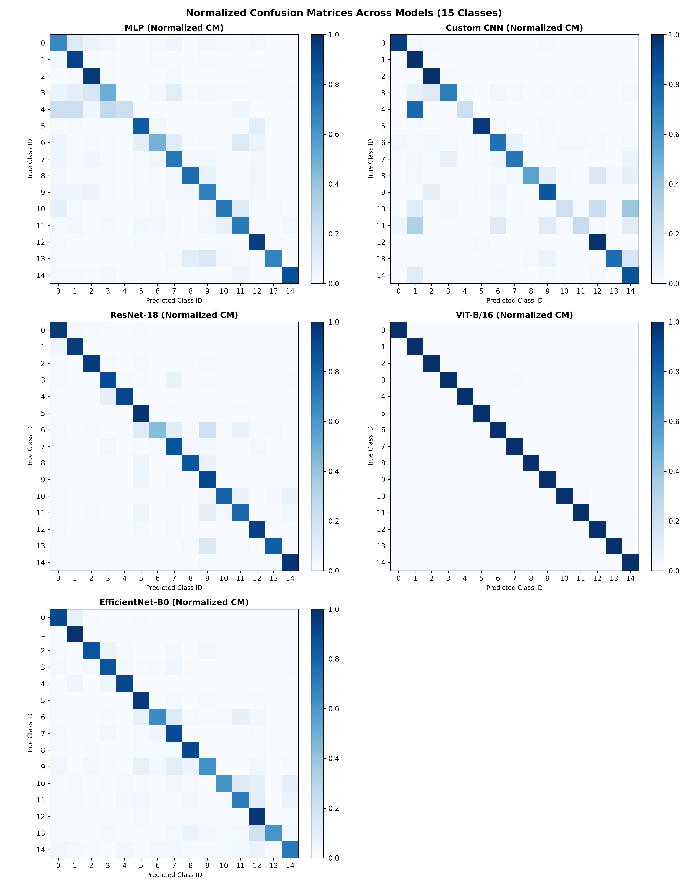

# Comparative Analysis of Deep Learning Architectures for Plant Disease Classification

An empirical benchmarking study comparing multiple deep learning architectural paradigms on the PlantVillage leaf disease classification task under a standardized experimental protocol.

---

## 📌 Project Overview

This project presents a systematic comparative evaluation of four distinct neural network architecture families on the **PlantVillage** dataset. The goal of this study is to analyze the trade-offs between non-spatial baselines, convolutional feature extractors, residual networks, and vision transformers under identical data partitioning and evaluation metrics.

### Evaluated Model Paradigms

1. **MLP Baseline** (`MLPBaseline`): A non-spatial fully connected baseline operating on flattened raw pixel vectors (150,528 features), establishing the performance floor for non-spatial architectures.
2. **Custom CNN** (`CNNBaseline`): A 4-stage convolutional neural network with batch normalization and global average pooling, trained entirely from scratch.
3. **ResNet-18** (`ResNet`): An 18-layer residual convolutional network fine-tuned from ImageNet-1K pretrained weights via a two-phase transfer learning schedule.
4. **Vision Transformer** (`ViT-B/16`): A self-attention architecture (16×16 patch size, 196 image patches) fine-tuned from ImageNet-1K pretrained weights.
5. **EfficientNet-B0** (`EfficientNet`): A compound-scaled convolutional network retained as an **additional reference benchmark**.

---

## 🔬 Motivation & Experimental Integrity

Plant disease identification is a critical computer vision task where early visual symptom detection requires robust spatial feature extraction. Evaluating deep learning models across disparate publications often suffers from inconsistent dataset splits, varying image resolutions, and conflicting metric definitions.

To ensure a **rigorous and fair comparison**, all experiments in this repository adhere to a strictly unified evaluation framework:
* **Fixed Data Partitioning**: Identical 70% training, 15% validation, and 15% testing splits across all models.
* **Deterministic Class Mapping**: Consistent 15-class target ordering aligned with label indices.
* **Standardized Preprocessing**: Uniform 224×224 input spatial resolution and ImageNet normalization.
* **Identical Metric Implementations**: Standardized computation of Top-1 Accuracy, Macro-Averaged Precision, Recall, Macro-F1, and Top-3 Accuracy.

---

## 🏗 Model Architectures

| Model | Architecture Family | Training Approach | Parameters | Role in Study |
| :--- | :--- | :--- | :---: | :--- |
| **MLP** | Dense / Non-Spatial | From scratch | ~77.24M | Baseline for flattened pixel inputs |
| **Custom CNN** | Convolutional Neural Network | From scratch | ~0.39M | Spatial learning baseline from scratch |
| **ResNet-18** | Residual Convolutional Neural Network | ImageNet transfer learning | ~11.18M | Pretrained residual CNN architecture |
| **ViT-B/16** | Vision Transformer / Self-Attention | ImageNet transfer learning | ~85.81M | Attention-based vision architecture |
| *EfficientNet-B0* | Compound-Scaled CNN | ImageNet transfer learning | ~4.03M | Additional reference benchmark |

---

## 📊 Experimental Results

All quantitative metrics are computed on the held-out **3,096-image test set** using the globally best checkpoint (selected by validation macro-F1).

### Official Four-Model Academic Comparison

| Model | Test Accuracy | Macro Precision | Macro Recall | Macro-F1 | Top-3 Accuracy |
| :--- | :---: | :---: | :---: | :---: | :---: |
| **MLP** | 77.42% | 77.36% | 71.27% | 72.07% | 94.54% |
| **Custom CNN** | 76.94% | 78.84% | 71.76% | 70.81% | 91.63% |
| **ResNet-18** | **88.53%** | **88.64%** | **86.97%** | **87.06%** | **98.29%** |
| **ViT-B/16** | 99.77% | 99.79% | 99.80% | 99.79% | 100.00% |

### Additional Reference Benchmark

| Model | Test Accuracy | Macro Precision | Macro Recall | Macro-F1 | Top-3 Accuracy |
| :--- | :---: | :---: | :---: | :---: | :---: |
| **EfficientNet-B0** | 82.69% | 81.13% | 81.10% | 79.89% | 95.51% |

> *Note: ViT-B/16 architecture integration and official full-dataset 23-epoch fine-tuning were executed and verified with CUDA acceleration.*

---

## 📈 Key Findings

Based strictly on empirical evaluation outputs in [`reports/comparison/factual_observations.md`](reports/comparison/factual_observations.md):

* **Top Performer**: **ResNet-18** achieved the highest overall performance with a **88.53% Test Accuracy**, **87.06% Macro-F1**, and **98.29% Top-3 Accuracy**.
* **Pretrained vs. From-Scratch Gap**: ResNet-18 exceeded the from-scratch Custom CNN by **+11.60 percentage points** in accuracy and **+16.25 percentage points** in Macro-F1. This result is consistent with the hypothesis that pretrained visual features provide stronger inductive priors for agricultural imagery, although this experiment does not isolate pretraining as the sole causal factor.
* **Parameter Efficiency**: The lightweight Custom CNN (392K parameters) achieved competitive accuracy (76.94%) relative to the massive unregularized MLP (77.2M parameters, 77.42%), demonstrating the effectiveness of convolutional inductive bias (translation equivariance) over parameter scale alone.
* **Top-3 Coverage**: All evaluated models attained greater than **91.6% Top-3 Accuracy**, confirming that the correct disease class ranks among the top three predictions in the vast majority of test instances.

---

## 🖼 Visual Comparisons

### Multi-Metric Comparison & Accuracy vs. F1
<p align="center">
  
  
</p>

### Parameter Efficiency Trade-off & Per-Class F1 Heatmap
<p align="center">
  
  
</p>

### Normalized Confusion Matrices
<p align="center">
  
</p>

---

## 🖥️ Interactive Demo

The project includes an optional Streamlit frontend for interactive inference demonstrations. This is separate from academic training.

1. Ensure your best ViT-B/16 checkpoint is located at: `reports/vit_b16/checkpoints/vit_b16_best.pt`
2. Start the application:
   ```bash
   .\.venv\Scripts\python.exe -m streamlit run app.py
   ```
   *(Alternatively: `streamlit run app.py`)*
3. Open the local URL displayed in the terminal.
4. Upload a PNG, JPG, or JPEG leaf image.
5. View the predicted class and Top-3 confidence scores.

For more details, refer to [docs/FRONTEND.md](docs/FRONTEND.md).

### Automated Frontend Test

You can automatically run the frontend pipeline on a small subset of test images:
```bash
.\.venv\Scripts\python.exe scripts\test_inference.py --samples-per-class 3 --split test --seed 42 --device auto --output-dir reports/frontend_test
```
- It runs 3 deterministic test images per class (up to 45 images).
- It does not retrain the model.
- Generated reports remain local under `reports/frontend_test`.
- Sample-test results do not replace official full test-set metrics.

---

## 📁 Repository Structure

```text
plant-disease-model-comparison/
├── configs/                  # YAML experiment configurations for each architecture
│   ├── mlp.yaml
│   ├── cnn_custom.yaml
│   ├── resnet18.yaml
│   ├── vit_b16.yaml
│   └── efficientnet_b0.yaml
├── data/
│   └── splits/               # Deterministic train/val/test split and label mappings
│       ├── split.csv
│       └── label_map.json
├── docs/                     # Detailed guides and visual assets
│   ├── assets/               # Publication figures and comparative plots
│   ├── REPRODUCIBILITY.md    # Step-by-step reproduction guide
│   └── ACADEMIC_INTEGRITY.md # Codebase lineage & AI disclosure
├── reports_archive/          # Verified archived baseline runs (ResNet-18, EfficientNet-B0)
├── src/
│   ├── data/                 # Dataset loader, transforms, splitting utilities
│   ├── models/               # Model definitions (MLP, Custom CNN, Transfer architectures)
│   ├── explain/              # Model interpretability (Grad-CAM)
│   ├── train.py              # Modular training runner with two-phase fine-tuning
│   ├── eval.py               # Standalone test evaluation runner
│   ├── visualize.py          # Per-model training curves & confusion matrix generator
│   └── compare.py            # Unified cross-model comparison & report aggregator
├── scripts/                  # Shell execution scripts
├── requirements.txt          # Python dependencies
├── LICENSE                   # MIT License
└── README.md
```

---

## ⚙️ Installation & Setup

### 1. Clone Repository
```bash
git clone https://github.com/ArnDev7/plant-disease-model-comparison.git
cd plant-disease-model-comparison
```

### 2. Environment Configuration
```bash
python -m venv .venv
# On Linux/macOS:
source .venv/bin/activate
# On Windows:
.\.venv\Scripts\activate
```

### 3. Install Dependencies
```bash
pip install -r requirements.txt
```

> **PyTorch Acceleration Note**: To enable CUDA GPU acceleration, ensure your PyTorch build matches your installed CUDA driver. Refer to the [official PyTorch installation selector](https://pytorch.org/get-started/locally/).

---

## 🌿 Dataset Setup

This project uses the **PlantVillage** dataset consisting of 15 crop-disease classes (~20,600 images).

1. Download the dataset from Kaggle: [PlantVillage Dataset (Emma Rex)](https://www.kaggle.com/datasets/emmarex/plantdisease/data).
2. Extract the raw image folders to:
   ```text
   data/raw/PlantVillage/
   ```
3. **Important**: The repository provides precomputed stratified split files under `data/splits/split.csv` and `data/splits/label_map.json`. Do not regenerate these files when replicating benchmark numbers.

---

## 🚀 Execution Guide

### Training Models

```bash
# 1. MLP Baseline
python -m src.train --config configs/mlp.yaml

# 2. Custom CNN Baseline
python -m src.train --config configs/cnn_custom.yaml

# 3. ResNet-18
python -m src.train --config configs/resnet18.yaml

# 4. Vision Transformer (ViT-B/16)
python -m src.train --config configs/vit_b16.yaml

# 5. EfficientNet-B0 (Benchmark)
python -m src.train --config configs/efficientnet_b0.yaml
```

### Evaluation & Visualization

```bash
# Evaluate best checkpoint on test set
python -m src.eval --config configs/mlp.yaml

# Generate per-model training curves and confusion matrices
python -m src.visualize --normalize_cm --config configs/mlp.yaml
```

### Generating Unified Cross-Model Comparison

To aggregate metrics, generate publication tables (Markdown, LaTeX, CSV), and render all comparative charts:

```bash
python -m src.compare
```
*Outputs are saved to `reports/comparison/`.*

---

## 👤 Author

**Arnav Tiwari**

Individual project covering repository integration, architecture implementation, experiment execution, GPU validation, evaluation, cross-model comparison, and technical documentation.

---

## 🔒 Attribution and Academic Integrity

This repository extends the open-source project:
* **Upstream Project**: [CharlesWang185/plantvillage-disease-classifier](https://github.com/CharlesWang185/plantvillage-disease-classifier)
* **Upstream License**: MIT License (Copyright © 2026 CharlesWang185)

The base repository supplied an existing PlantVillage classification and transfer-learning pipeline. The extensions implemented in this repository include:
* MLP baseline architecture (`src/models/mlp.py`)
* Custom CNN baseline architecture trained from scratch (`src/models/cnn_baseline.py`)
* Vision Transformer (ViT-B/16) integration (`src/models/transfer.py`)
* Configuration-aware output handling (`configs/`)
* GPU execution validation
* Unified model-comparison framework (`src/compare.py`)
* Expanded comparative evaluation and technical documentation

### AI-Assistance Disclosure
AI-assisted development tools were used for implementation planning, code review, debugging support, validation planning, and documentation refinement. All suggested changes were reviewed and executed against the repository, and all reported experiment metrics were obtained from saved model runs rather than generated by an AI system.

For detailed attribution notes and upstream licensing, see [docs/ACADEMIC_INTEGRITY.md](docs/ACADEMIC_INTEGRITY.md).

---

## ⚠️ Limitations & Future Work

### Limitations
* **Controlled Lab Conditions**: PlantVillage images feature uniform backgrounds and lighting, which may not reflect real-world agricultural field variability.
* **Single Partition Evaluation**: Metrics are computed on a single fixed 70/15/15 split; multi-seed statistical significance testing was not conducted.
* **Inductive Bias Confounding**: Architectural differences and pretraining status are evaluated jointly; transfer learning advantages cannot be isolated as the sole causal driver.

### Future Work
* Cross-dataset generalizability testing on field-collected leaf datasets (e.g., PlantDoc).
* Exploration of vision-transformer attention rollout and transformer-specific interpretability methods.
* Lightweight model quantization (INT8/FP16) for edge and mobile deployment.

---

## 📄 References & License

* **Dataset**: [PlantVillage (Hughes & Salathé, 2015)](https://arxiv.org/abs/1511.08060)
* **Frameworks**: [PyTorch](https://pytorch.org/), [torchvision](https://pytorch.org/vision/)
* **License**: Distributed under the [MIT License](LICENSE) (Copyright © 2026 CharlesWang185 / Contributors).
